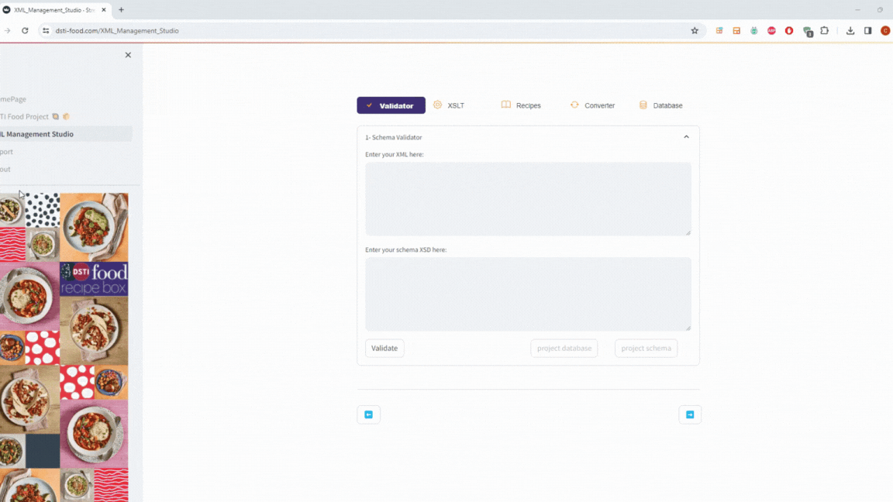
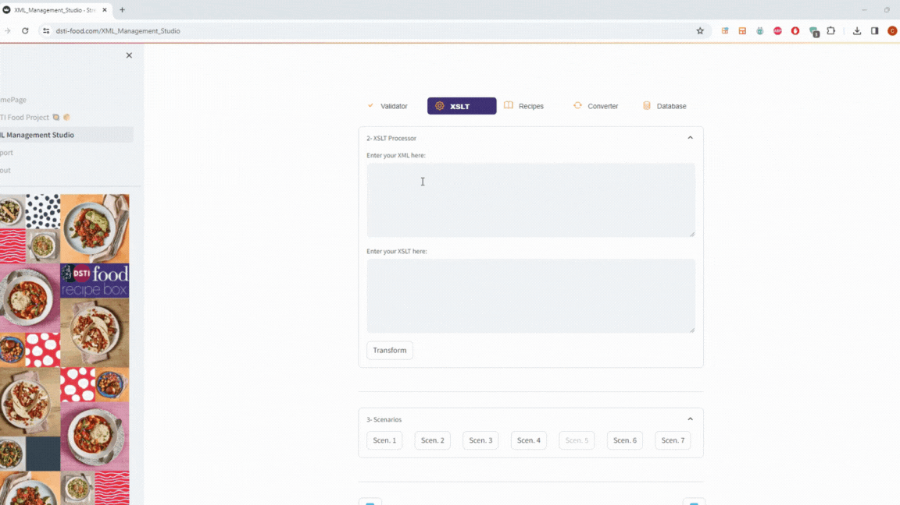

# Data_Pipeline_Project
This is the repository for the group project of Data Pipeline course.

# Project description
The project subject is the modeling of an XML database for the information system
of a recipe box company.
Our database contains 51 recipes of various types of meals with different categories that
can be visualized using XSLT transformations.

# Webapp
The project can be easily navigated with a webapp at the following address:
https://www.dsti-food.com/

Here is a demo : 
< img>

Schema validator
< img>

XSLT transformer : 
< img>

XSLT scenarios : 
< img>

Recipes : 
< img>

Converter & Preview Database : 
< img>

# Files
The repository contains the following files:
 - README.md
 - food_withNS.xml: database of our project in XML format
 - FoodSchema_withNS.xsd: XML schema of our database
 - FoodAllergens.xsd: additional XML schema related to allergies info
 - XSLT: transformations to HTML, XML, JSON
 - XML_ProjectReport.pdf: group report detailing model design and transformations.
